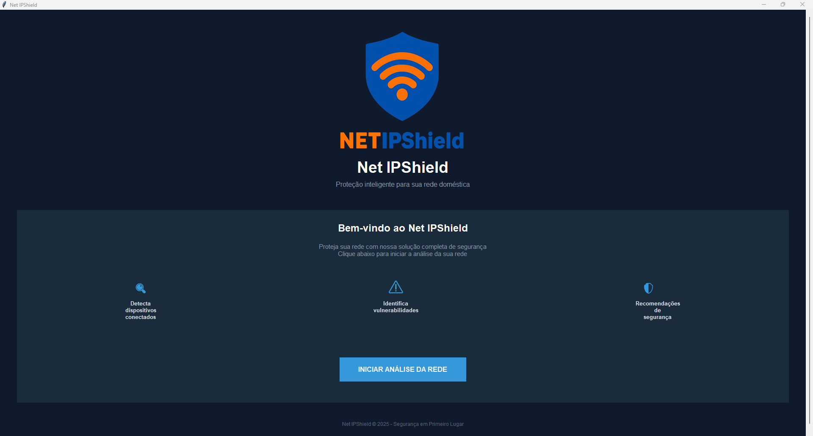
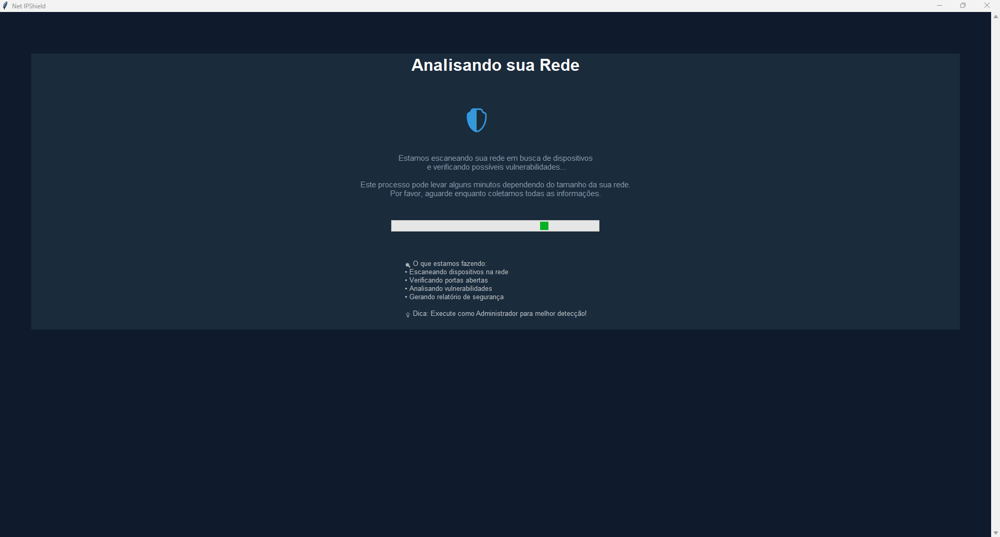
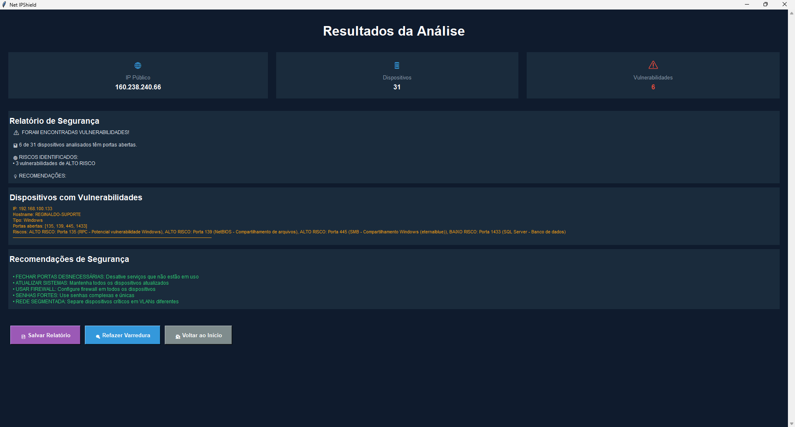

# 🛡️ Net IPShield

**Net IPShield** é uma aplicação desktop desenvolvida em Python para análise de segurança em redes domésticas. A ferramenta identifica dispositivos conectados, verifica portas abertas e detecta vulnerabilidades conhecidas, fornecendo recomendações práticas de segurança.

---

## 🚀 Funcionalidades

- 🔍 **Detecção de Dispositivos** - Identifica todos os dispositivos conectados na rede local
- 🛡️ **Análise de Vulnerabilidades** - Verifica portas abertas e serviços expostos
- ⚠️ **Classificação de Riscos** - Categoriza vulnerabilidades em baixo, médio e alto risco
- 📊 **Relatórios Detalhados** - Gera relatórios completos em formato texto
- 💡 **Recomendações Práticas** - Sugere ações específicas para melhorar a segurança
- 🎯 **Interface Moderna** - Design intuitivo e responsivo

---

## 🖼️ Screenshots

### Tela Inicial
Interface moderna e intuitiva para iniciar a análise de rede.



### Análise em Andamento  
Tela de carregamento durante o processo de varredura da rede.



### Resultados da Análise
Relatório completo com dispositivos encontrados e vulnerabilidades detectadas.



---

## 🛠️ Tecnologias Utilizadas

- **Python 3.8+**
- **Tkinter** - Interface gráfica
- **Socket** - Comunicação de rede e scan de portas
- **Threading** - Processamento paralelo
- **Pillow** - Manipulação de imagens
- **Requests** - Requisições HTTP para IP público
- **Subprocess** - Execução de comandos do sistema

---

## 📦 Instalação e Uso

### Pré-requisitos
- Python 3.8 ou superior
- Sistema Windows (testado no Windows 10/11)

### Instalação Manual
1. Clone o repositório:
```
git clone https://github.com/RegisnaldoJunior/net-ipshield.git
cd net-ipshield
```
Instale as dependências:

```
pip install -r requirements.txt
Execute a aplicação:
```

Execute a aplicação:
```
python main.py
```

🎯 Como Funciona
Arquitetura MVC
```
net-ipshield/
├── model/           # Lógica de negócio (network_scanner.py)
├── view/            # Interface (home_view.py, loading_view.py, results_view.py)
├── controller/      # Controlador (main_controller.py)
└── main.py          # Arquivo principal
```

Fluxo de Análise
Varredura de Rede - Utiliza tabela ARP e scan ativo para identificar dispositivos

Análise de Portas - Testa portas comuns em cada dispositivo encontrado

Classificação - Categoriza riscos baseado em vulnerabilidades conhecidas

Geração de Relatório - Cria arquivo texto com findings e recomendações

📋 Estrutura do Projeto
```
net-ipshield/
├── model/
│   ├── __init__.py
│   └── network_scanner.py
├── view/
│   ├── __init__.py
│   ├── home_view.py
│   ├── loading_view.py
│   └── results_view.py
├── controller/
│   ├── __init__.py
│   └── main_controller.py
├── images/
│   ├── tela_inicial.png
│   ├── tela_analise.png
│   └── tela_resultados.png
├── main.py
├── requirements.txt
├── README.md
└── logo.png
```

⚡ Uso Avançado
Build do Executável
Para criar um executável standalone:

```
python -m PyInstaller --onefile --windowed --name "NetIPShield" --icon=logo.ico --add-data "logo.png;." --hidden-import=PIL._tkinter_finder --hidden-import=tkinter main.py
```

Execução como Administrador
Para melhor detecção, execute como administrador.

⚠️ Limitações
- Análise básica de vulnerabilidades (não substitui ferramentas especializadas)

- Foco em redes domésticas pequenas/médias

- Funciona melhor em redes Windows

- Requer execução como administrador para detecção completa

